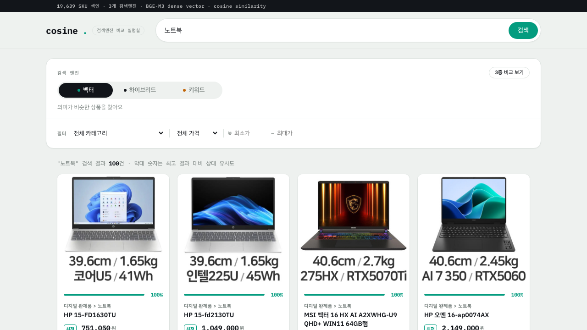
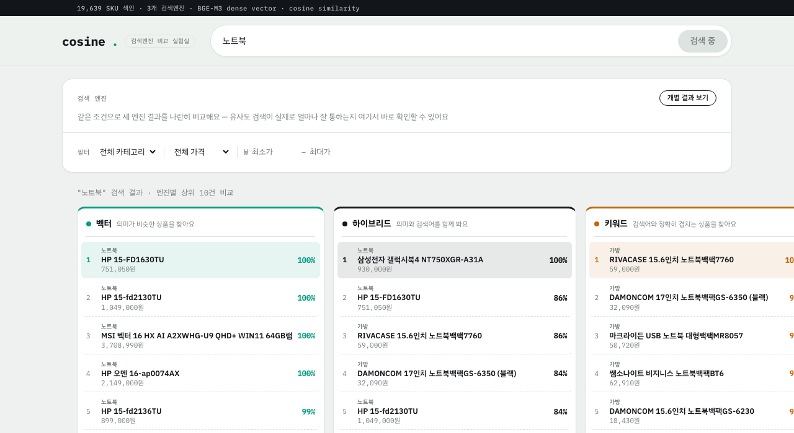
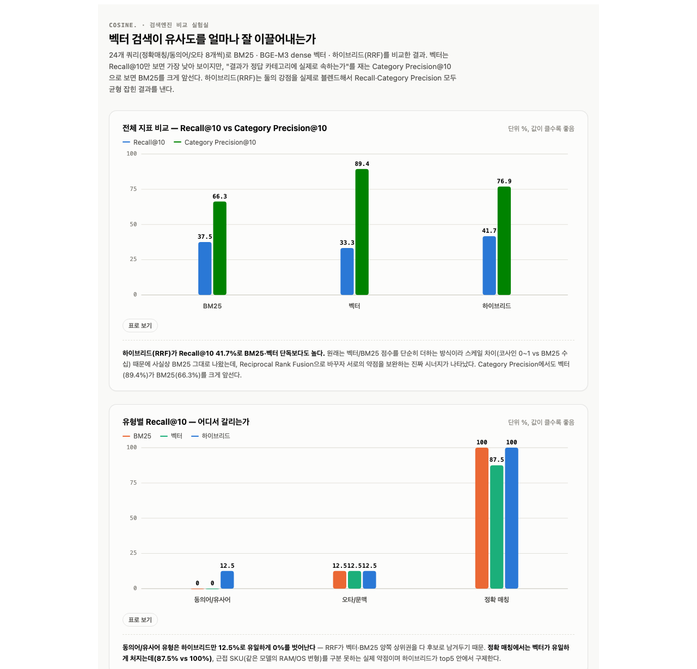

# cosine. — 검색엔진 비교 실험실

BGE-M3 임베딩 모델 + Elasticsearch kNN을 이용해, 쇼핑몰 상품 검색에서 벡터 유사도 검색이
키워드 검색(BM25) 대비 얼마나 관련성 높은 결과를 끌어내는지 검증하는 미니프로젝트.

## 스크린샷

**벡터 검색** — 19,639건(다나와 크롤링, 전자제품/가전) 중 "노트북"을 검색한 결과. 카드마다 유사도
스펙트럼 바(엔진별 색상: 벡터=teal)와 매치율, 카테고리/가격/쇼핑몰 최저가 비교가 표시된다.



**3종 비교 보기** — 같은 검색어("노트북")를 벡터/하이브리드/키워드 3개 엔진에 동시에 질의해서
나란히 비교. 벡터는 실제 노트북(HP, MSI 등)을 정확히 찾아내는 반면, 키워드(BM25)는 상품명에
"노트북"이라는 글자가 그대로 들어간 "노트북 백팩"류를 상위에 반환한다 — 이 프로젝트의 핵심 가설이
실제로 재현된 장면. 하이브리드(RRF)는 둘을 실제로 블렌드해서 노트북과 노트북 백팩이 섞여서 나온다.



## 아키텍처

```
[크롤러(Python)] → [PostgreSQL] → [임베딩 서비스(FastAPI+BGE-M3)] → [Elasticsearch(dense_vector)]
                                                                          ↑
                                                    [Spring Boot API] ← [React 검색 UI]
```

## 기술 스택

| 영역 | 기술 | 비고 |
|---|---|---|
| **크롤링** | Python 3.9, requests, BeautifulSoup4, psycopg2-binary | 다나와 통합검색 크롤링 (`crawler/`) |
| **저장** | PostgreSQL 16 | 원본 상품/가격 데이터 (Docker) |
| **임베딩** | FastAPI, BGE-M3(`FlagEmbedding` 1.3.2), PyTorch | 1024차원 dense vector, CPU 추론 |
| **검색엔진** | Elasticsearch 8.15.0 (nori 분석기 커스텀 빌드), Kibana 8.15.0 | `dense_vector` kNN + BM25 동시 지원 |
| **백엔드** | Spring Boot 3.3.2, Java 17, `elasticsearch-java` 8.15.0, WebFlux(WebClient), Spring JDBC | ES 쿼리, 임베딩 서비스 비동기 호출, Postgres 직접 조회 |
| **프론트엔드** | React 18.3, Vite 5.4, 순수 CSS | 프레임워크 없이 직접 디자인, IBM Plex Sans KR + IBM Plex Mono |
| **인프라** | Docker Compose | Postgres + Elasticsearch + Kibana 로컬 오케스트레이션 |

**구조 설계 이유**: BGE-M3는 Python 라이브러리(`FlagEmbedding`)라 Java에서 직접 구동하기 어려워, 임베딩 전용
FastAPI 마이크로서비스를 분리하고 Spring Boot가 REST로 호출하는 구조로 설계했다. 검색 결과의 `source_url`/
`image_url`처럼 ES 재색인 없이 최신값이 필요한 필드는 매 요청마다 Postgres에서 배치 조회해 합성한다
(`SearchService.fetchProductMeta`) — 임베딩에 안 쓰이는 필드(이미지 등)를 갱신할 때 재임베딩/재색인이
필요 없도록 하기 위함.

## 폴더 구조

```
vector-shop-search/
├── crawler/            # 상품 크롤러 (Python)
├── embedding-service/  # BGE-M3 임베딩 FastAPI 서버 + 배치 색인 스크립트
├── backend/            # Spring Boot 검색 API
├── frontend/           # React 검색 UI
├── infra/              # docker-compose (Postgres, Elasticsearch, Kibana)
└── docs/               # 평가 결과, 회고
```

## 로컬 실행 순서

1. **인프라 기동**
   ```bash
   cd infra
   docker compose up -d
   ```

2. **크롤러 실행 (상품 데이터 → Postgres)**
   ```bash
   cd crawler
   pip install -r requirements.txt --break-system-packages
   python crawl_products.py
   ```

3. **임베딩 서비스 기동**
   ```bash
   cd embedding-service
   pip install -r requirements.txt --break-system-packages
   uvicorn app.main:app --reload --port 8000
   ```

4. **배치 색인 (Postgres → BGE-M3 → Elasticsearch)**
   ```bash
   cd embedding-service
   python scripts/index_to_es.py
   ```

5. **백엔드 실행**
   ```bash
   cd backend
   ./gradlew bootRun
   ```

6. **프론트 실행**
   ```bash
   cd frontend
   npm install
   npm run dev
   ```

## Git 브랜치 전략

- `main`: 항상 동작하는 상태만 머지
- `dev`: 통합 개발 브랜치
- `feat/crawler`, `feat/embedding`, `feat/backend-search`, `feat/frontend-ui`: 기능별 브랜치
- 커밋 컨벤션: `feat:`, `fix:`, `docs:`, `refactor:`, `test:`

## 평가 결과

24개 쿼리(정확매칭/동의어/오타 8개씩), `docs/eval_runner.py`로 자동 측정. 상세 방법론과 케이스 스터디는
`docs/evaluation.md` 참고.



### 전체 Recall

| 검색 방식 | Recall@5 | Recall@10 |
|---|---|---|
| BM25 단독 | 37.50% | 37.50% |
| BGE-M3 dense 벡터 단독 | 29.17% | 33.33% |
| **하이브리드 (RRF)** | **41.67%** | **41.67%** |

하이브리드는 처음엔 벡터/BM25 점수를 단순히 더하는 방식이었는데, 두 점수의 스케일이 완전히 달라서
(코사인 0~1 vs BM25 수십 단위) 사실상 BM25 순위 그대로 나오는 문제가 있었다. Reciprocal Rank Fusion(RRF)
으로 바꾸자 BM25/벡터 단독보다도 더 높은 Recall이 나왔다 — 서로의 약점을 진짜로 보완하는 시너지.

### 유형별 Recall@10 breakdown

| 유형 | BM25 | 벡터 | 하이브리드 |
|---|---|---|---|
| 동의어/유사어 | 0.00% | 0.00% | **12.50%** |
| 오타/문맥 | 12.50% | 12.50% | 12.50% |
| 정확 매칭 | 100.00% | 87.50% | 100.00% |

동의어/오타 유형은 정답 ID 자체가 카테고리 규모(수백 건) 대비 너무 적게 지정된 평가셋의 한계라
recall@k가 전반적으로 낮다. 정확 매칭에서만 벡터가 유일하게 처지는데(87.5% vs 100%), 이건 실제
약점(근접 SKU 구분 실패)이고 하이브리드가 완전히 구제한다(단, top1은 아니고 top5 안에서 구제 —
`docs/evaluation.md` 케이스 스터디 2번 참고).

### Category Precision@k (동의어/오타 16개 쿼리, 진짜 성능 차이가 드러나는 지표)

| 검색 방식 | CatP@5 | CatP@10 |
|---|---|---|
| BM25 단독 | 65.00% | 66.25% |
| **BGE-M3 dense 벡터 단독** | **92.50%** | **89.38%** |
| 하이브리드 (RRF) | 80.00% | 76.88% |

**결론**: "결과가 정답 카테고리에 실제로 속하는가"로 재면 벡터가 BM25를 큰 폭으로 앞선다(89% vs 66%) —
동의어/문맥 이해가 실제로 우수하다는 원래 가설이 지지됨. 하이브리드(RRF)는 BM25와 벡터 사이의 값(77~80%)이
나와서 실제로 두 방식의 이해를 블렌드하고 있음을 확인했다. 다만 근접 SKU 구분처럼 "한쪽이 훨씬 확신이
높은" 케이스에선 RRF가 그 확신 차이를 반영하지 못하는 한계도 있다. "노트북" 케이스 스터디를 포함한 자세한
분석은 `docs/evaluation.md` 참고.

## 원칙

- 실습 과정임을 명확히: 겪지 않은 문제를 지어내지 않음
- 사용하지 않은 기술 overclaim 금지
- 크롤링 대상 사이트의 robots.txt / 이용약관 확인 후 진행
